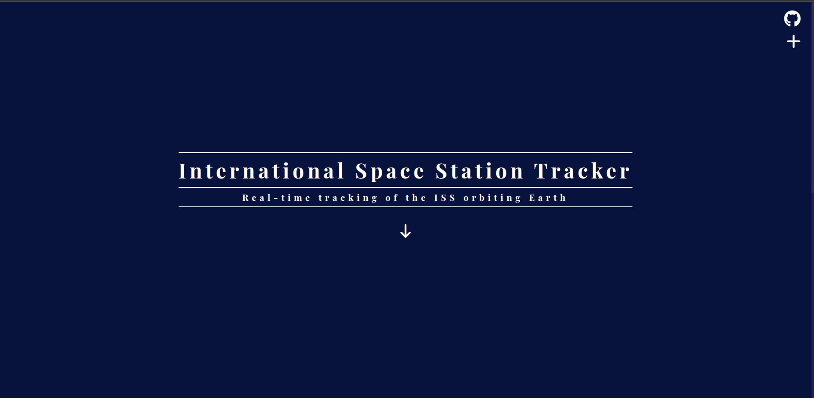
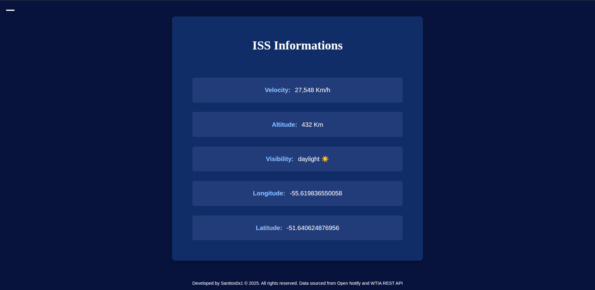
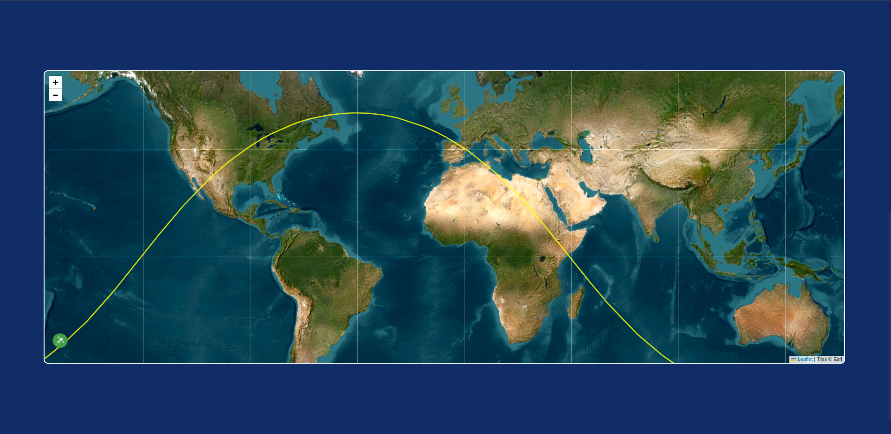

# 🛰️ ISS Tracker

A real-time International Space Station (ISS) tracker built with Django, displaying the current location and information about the ISS using interactive maps.




---


## 🌟 Features

- **Real-time ISS Location**: Track the International Space Station's current position
- **Interactive Map**: Visual representation of the ISS location on a world map
- **Responsive Design**: Works perfectly on desktop, tablet, and mobile devices
- **Modern UI**: Clean, space-themed interface with smooth animations
- **Live Data**: Fetches real-time data from Open Notify API and WTIA REST API

## 🚀 Tech Stack

- **Backend**: Django 4.x
- **Frontend**: HTML5, CSS3, JavaScript
- **API**: [Open Notify API](http://api.open-notify.org/) | [WTIA REST API](https://wheretheiss.at/w/developer)
- **Styling**: Custom CSS with CSS Variables
- **Maps**: Interactive mapping integration
- **Fonts**: Google Fonts (Roboto Slab, Playfair Display)

## 🛠️ Installation

### Prerequisites
- Python 3.8+
- Django 4.x
- Git

### Setup

1. **Clone the repository**
   ```bash
   git clone https://github.com/santtos0x1/ISS-Tracker.git
   cd iss-tracker
   ```

2. **Create virtual environment**
   ```bash
   python -m venv venv
   
   # Windows
   venv\Scripts\activate
   
   # macOS/Linux
   source venv/bin/activate
   ```

3. **Install dependencies**
   ```bash
   pip install -r requirements.txt
   ```

4. **Run migrations**
   ```bash
   python manage.py migrate
   ```

5. **Start development server**
   ```bash
   python manage.py runserver
   ```

6. **Access the application**
   Open your browser and go to `http://127.0.0.1:8000`

## 🌐 API Integration

This project uses the [Open Notify API](http://api.open-notify.org/) to fetch real-time ISS data:

- **ISS Current Location**: `http://api.open-notify.org/iss-now.json`

---

---

## 🎨 Features in Detail

### Real-time Tracking
- Fetches ISS coordinates every few seconds
- Updates map position dynamically
- Shows timestamp of last update

### Interactive Map
- Responsive map integration
- Custom markers for ISS position
- Zoom and pan capabilities

### Modern Design
- CSS Grid and Flexbox layouts
- Smooth hover effects and transitions
- Mobile-first responsive design
- Dark space theme with blue accents

## 📱 Responsive Design

The application is fully responsive and works on:
- 📱 Mobile devices (320px+)
- 📱 Tablets (768px+)
- 💻 Desktop (1024px+)
- 🖥️ Large screens (1440px+)

## 🤝 Contributing

1. Fork the project
2. Create your feature branch (`git checkout -b feature/AmazingFeature`)
3. Commit your changes (`git commit -m 'Add some AmazingFeature'`)
4. Push to the branch (`git push origin feature/AmazingFeature`)
5. Open a Pull Request

## 📋 TODO

- [ ] Add ISS pass predictions for user location
- [ ] Implement astronaut information display
- [ ] Add notification system for ISS overhead passes
- [ ] Create historical trajectory visualization
- [ ] Add multiple language support
- [ ] Implement dark/light theme toggle

## 📄 License

This project is licensed under the MIT License - see the [LICENSE](LICENSE) file for details.

## 🙏 Acknowledgments

- **NASA** - For making ISS data publicly available
- **Open Notify** - For providing the ISS tracking API
- **Django Community** - For the amazing framework
- **Contributors** - Thank you for your contributions!

---

⭐ Don't forget to star this repository if you found it helpful!

🛰️ Happy tracking! The ISS is currently traveling at ~17,500 mph around Earth!
